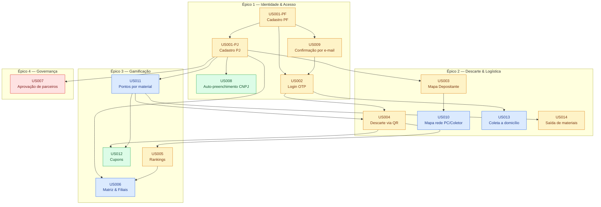
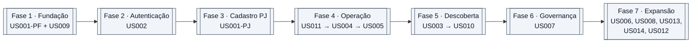
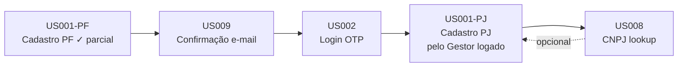
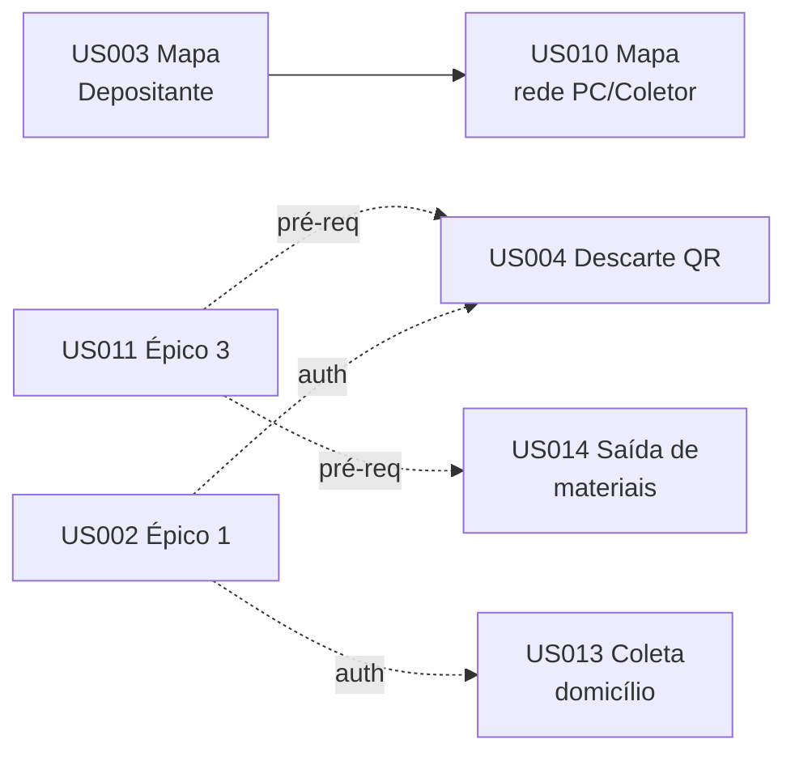
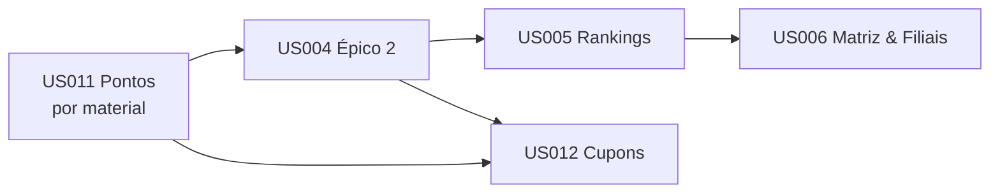
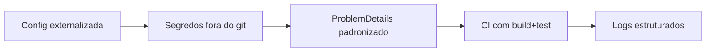

# EcoCell — Backlog Técnico

Derivado de [`PRD EcoCell – Ecossistema de Logística Reversa.md`](../PRD%20EcoCell%20%E2%80%93%20Ecossistema%20de%20Log%C3%ADstica%20Reversa.md). O PRD é a fonte de verdade do "porquê"; este arquivo é o "como" — tarefas pequenas, atômicas e rastreáveis.

## Convenções

- **Prioridade** herdada do RF: `Crítico` > `Essencial` > `Importante` > `Desejável`.
- **Status**: `[ ]` pendente · `[~]` em andamento · `[x]` concluído.
- **TDD obrigatório** (Red → Green → Refactor) — teste antes do código produtivo. Dentro de cada US as tarefas seguem a ordem: **DTOs em `Ecocell.Shared` → Testes (Red) → Slice em `Features/<Agregado>/<Feature>.cs` (Green) → Testes de integração**.
- **Arquitetura VSA** (Vertical Slice): um slice = **um arquivo** em `Features/<Agregado>/<Feature>.cs` contendo `Command`, `Validator`, `Handler` e `ICarterModule`. **Sem repositories abstratos, sem camadas extras.** Handler injeta `AppDbContext` diretamente. Veja [`coding-rules.md`](rules/coding-rules.md).
- **Regras de Negócio (RN001–RN017, seção 5 do PRD) são normativas** — têm precedência sobre decisões de implementação. Citações `**RNxxx**` marcam aderência obrigatória.
- **DRY**: buscar reuso em `Ecocell.Api/Extensions/FluentValidationExtensions.cs`, `Ecocell.Api/Shared/`, `Ecocell.Shared/Requests` e `Ecocell.Shared/Responses`. Interfaces de serviço só quando ≥ 2 consumidores reais.
- **KISS**: nada de abstração sem dois consumidores reais. Sem `Domain/Services/`, sem `IRepository<T>`, sem builders em test utilities.
- Summaries PT-BR em toda classe/método público.
- Rodar `dotnet test Ecocell.slnx` ao final de cada tarefa.

---

## Visão macro — Dependências entre User Stories

## Plano MVP — Execução faseada

---

## Épico 1 — Gestão de Identidade e Acesso

### Fluxo interno do Épico 1

### US001-PF — Cadastro de Pessoa Física · RF001 · Essencial

**Dependências:** nenhuma.
**Estado atual:** Slice `RegisterNaturalPerson` parcial — validação e persistência prontas, envio de e-mail comentado.

- [ ] Remover TODO e descomentar bloco de envio em `RegisterNaturalPerson.Handler` (`Task.WhenAll` com `IMailService` + agendamento de expiração via Hangfire).
- [ ] Testes em `tests/Ecocell.UnitTests/Features/Person/RegisterNaturalPersonTests.cs` (já existentes — verificar cobertura):
  - [ ] `Handle_ShouldPersistInDatabase_WhenRequestIsValid`
  - [ ] `[Theory]` por campo inválido: CPF, e-mail, nome
  - [ ] `Handle_ShouldReturnConflict_WhenCpfAlreadyExists`
  - [ ] `Handle_ShouldReturnConflict_WhenEmailAlreadyExists`
- [ ] **Mobile:** tela `Components/Pages/Person/RegisterNaturalPerson.razor` — formulário com máscara de CPF de `wwwroot/js/masks.js`.

### US001-PJ — Cadastro de Pessoa Jurídica (pelo Gestor PF logado) · RF001 · Essencial

**Dependências:** US002 (autenticação do Gestor PF).
**Estado atual:** ✅ Backend concluído.

**US001-PJ.A — Backend**

- [x] Criar entidade `Address` + `AddressTypeConfiguration` + migration `AddAddressTable`.
- [x] Criar extensão `IsValidEmail` em `FluentValidationExtensions` + refatorar `RegisterNaturalPerson.Validator`.
- [x] Criar `RequestRegisterLegalPerson` + `RequestRegisterLegalPersonAddress` em `Ecocell.Shared/Requests/`.
- [x] Criar slice `Features/Person/RegisterLegalPerson.cs` com `Command`, `Validator`, `Handler` e `RegisterLegalPersonEndpoint : ICarterModule`.
- [x] `Validator`: CNPJ obrigatório e válido; razão social, nome fantasia e endereço obrigatórios; `Journey` deve ser `CollectPoint` ou `Collector` — **RN003**.
- [x] Testes em `tests/Ecocell.UnitTests/Features/Person/RegisterLegalPersonTests.cs` (20 testes, todos passando):
  - [x] `Handle_ShouldPersistInDatabase_WhenRequestIsValidAsCollectPoint`
  - [x] `Handle_ShouldPersistInDatabase_WhenRequestIsValidAsCollector`
  - [x] `Handle_ShouldPersistAddressInDatabase_WhenRequestIsValid`
  - [x] `Handle_ShouldSetStatusPendingApproval_WhenRequestIsValid`
  - [x] `Handle_ShouldPublishLegalPersonRegistered_WhenSuccess`
  - [x] `Handle_ShouldReturnConflict_WhenCnpjAlreadyExists`
  - [x] `Handle_ShouldReturnConflict_WhenEmailAlreadyExists`
  - [x] `Handle_ShouldReturnValidationError_WhenJourneyIsDepositor` **(RN003)**
  - [x] `[Theory]` por campo inválido: CNPJ, e-mail, razão social, State, ZipCode
  - [x] `Handle_ShouldReturnNotFound_WhenResponsiblePersonDoesNotExist`
  - [x] `Handle_ShouldReturnForbidden_WhenResponsiblePersonIsNotActive`
- [x] `Handler`: injeta `AppDbContext`, `IPublisher`; vincula a PJ ao `ResponsiblePersonId` extraído do JWT; status inicial `PendingApproval` **(RN007)**.
- [x] Evento `LegalPersonRegistered` + `SendRegistrationEmailOnLegalPersonRegistered` (NotificationHandler fire-and-forget).
- [x] Endpoint `POST /api/legal-person` (requer `AuthorizationPolicies.Authenticated`).

**US001-PJ.B — Mobile**

- [ ] Criar `ILegalPersonClient` (Refit); registrar via `AddRefitClient` em `MauiProgram.cs`.
- [ ] Criar `LegalPersonViewModel`.
- [ ] Página `Components/Pages/Person/RegisterLegalPerson.razor` — formulário com seleção de papel (PC ou Coletor) e máscara de CNPJ de `wwwroot/js/masks.js`.
- [ ] Acesso à tela disponível apenas para PF autenticado (verificar `AuthStateService`).

### US008 — Auto-preenchimento PJ via CNPJ · RF002 · Desejável

**Dependências:** US001-PJ (tela de cadastro PJ).
**Estado atual:** inexistente.

**US008.A — Serviço de consulta**

- [ ] Criar interface `Ecocell.Api/Services/External/ICnpjLookupService`; implementação `BrasilApiCnpjLookupService` usando `IHttpClientFactory` + `IMemoryCache` (TTL 10 min).
- [ ] Registrar `HttpClient` com `BaseAddress` `https://brasilapi.com.br/api/cnpj/v1/` e timeout 5 s em `AddApi`.
- [ ] Testes em `tests/Ecocell.UnitTests/Features/Cnpj/CnpjLookupTests.cs`:
  - [ ] `Lookup_ShouldReturnData_WhenCnpjIsValid`
  - [ ] `Lookup_ShouldReturnNull_WhenCnpjNotFound`
  - [ ] `Lookup_ShouldReturnNull_WhenTimeout` (fallback transparente — não bloqueia cadastro)

**US008.B — Slice de consulta**

- [ ] Criar `ResponseCnpjLookupJson` em `Ecocell.Shared/Responses/`.
- [ ] Criar slice `Features/Cnpj/GetCnpjData.cs`; `Handler` injeta `ICnpjLookupService`.
- [ ] Testes em `tests/Ecocell.UnitTests/Features/Cnpj/GetCnpjDataTests.cs`.
- [ ] Endpoint `GET /api/v1/cnpj/{document}` (requer autenticação).

**US008.C — Mobile**

- [ ] Criar `ICnpjClient` (Refit).
- [ ] Handler de blur no campo CNPJ de `RegisterLegalPerson.razor`.
- [ ] Exibir `MudProgressLinear` durante a chamada; `MudSnackbar` em caso de erro.
- [ ] Desabilitar auto-preenchimento se situação ≠ "Ativa" e exigir confirmação explícita.

### US009 — Confirmação de conta por e-mail · RF003 · Essencial

**Dependências:** US001-PF.
**Estado atual:** `Person.VerificationCode` + `ExpirationDateVerificationCode` existem (✓). Envio comentado no `RegisterNaturalPerson.Handler`.

**US009.A — Serviço de e-mail**

- [x] Interface `Ecocell.Api/Services/Email/IEmailSender` + implementação `MailKitEmailSender` (pacote `MailKit` adicionado). Contrato unificado via `EmailType` enum — `SendAsync(email, EmailType, variables?, ct)`.
- [x] `MailSettings` (Host, Port, User, Pass, From) em `Ecocell.Api/Configurations/`. Registrado em `AddApi` para todos os ambientes (Prod/Staging/Dev).
- [x] Credenciais em User Secrets.
- [x] Documentar em `appsettings.Example.json`.

**US009.B — Jobs de expiração/reenvio**

- [ ] Criar `VerificationCodeJobs` em `Ecocell.Api/Jobs/` com `Delete(personId, minutes)` e `Resend(personId)` via Hangfire; `Resend` injeta `IMailService`.
- [ ] Testes em `tests/Ecocell.UnitTests/Jobs/VerificationCodeJobsTests.cs`:
  - [ ] `Delete_ShouldClearCode_WhenPersonExists`
  - [ ] `Resend_ShouldGenerateNewCodeAndSendEmail`

**US009.C — Contador de tentativas**

- [ ] Adicionar `Person.VerificationAttempts` (int, default 0). Migration `AddVerificationAttempts`.

**US009.D — Slice de confirmação**

- [ ] Criar `RequestConfirmAccountJson` em `Ecocell.Shared/Requests/Account/`.
- [ ] Criar slice `Features/Account/ConfirmAccount.cs` com `Command`, `Validator`, `Handler` e `ConfirmAccountEndpoint : ICarterModule`.
- [ ] Testes em `tests/Ecocell.UnitTests/Features/Account/ConfirmAccountTests.cs`:
  - [ ] `Handle_ShouldActivateAccount_WhenCodeIsValid`
  - [ ] `Handle_ShouldReturnError_WhenCodeExpired`
  - [ ] `Handle_ShouldIncrementAttempts_WhenCodeIsInvalid`
  - [ ] `Handle_ShouldBlockAccount_WhenMaxAttemptsReached`
  - [ ] `Handle_ShouldReturnError_WhenAccountAlreadyActive`
- [ ] Endpoint `POST /api/v1/account/confirm`.
- [ ] Criar slice `Features/Account/ResendVerificationCode.cs` + endpoint `POST /api/v1/account/resend-code`.

**US009.E — Religar envio no cadastro**

- [ ] Descomentar bloco de envio em `RegisterNaturalPerson.Handler` (`Task.WhenAll` com `IMailService` + `VerificationCodeJobs.Delete`).
- [ ] Replicar o mesmo bloco em `RegisterLegalPerson.Handler`.
- [ ] Se o bloco aparecer em ≥ 3 Handlers, extrair método estático em `Ecocell.Api/Shared/` (KISS: 3 consumidores).

**US009.F — Mobile**

- [ ] Página `Components/Pages/Account/ConfirmAccount.razor` com 6 inputs.
- [ ] Botão "Reenviar código" com cooldown de 60 s.
- [ ] Redirecionamento automático para tela de login ao confirmar.
- [ ] Adicionar métodos `Confirm` e `Resend` no `IAccountClient` já existente.

### US002 — Login Passwordless (OTP) · RF004 · Essencial

**Dependências:** US009.
**Estado atual:** inexistente.

**US002.A — Emissão de JWT**

- [ ] Criar interface `Ecocell.Api/Services/Security/ITokenService` (`Generate(person) → string`); implementação `JwtTokenService` com claims `sub` (ExternalId), `role`, `person_type`.
- [ ] Criar `JwtSettings` (Issuer, Audience, SigningKey, ExpirationMinutes) em `Ecocell.Api/Configurations/`.
- [ ] Registrar em `AddApi`; configurar `AddAuthentication().AddJwtBearer()` em `Program.cs`.

**US002.B — Slice: solicitar código**

- [ ] Criar `RequestLoginCodeJson` em `Ecocell.Shared/Requests/Auth/` com campo `Identifier` (CPF ou e-mail).
- [ ] Criar slice `Features/Auth/RequestLoginCode.cs`; `Validator` detecta e valida CPF ou e-mail — **RN010**.
- [ ] Testes em `tests/Ecocell.UnitTests/Features/Auth/RequestLoginCodeTests.cs`:
  - [ ] `Handle_ShouldSendCode_WhenIdentifierIsEmail` **(RN010)**
  - [ ] `Handle_ShouldSendCode_WhenIdentifierIsCpf` **(RN010)**
  - [ ] `Handle_ShouldReturnSuccess_WhenAccountNotFound` (silencioso — evitar enumeração)
  - [ ] `Handle_ShouldReturnError_WhenAccountPendingConfirmation`
  - [ ] `Handle_ShouldReturnError_WhenAccountBlocked`
- [ ] Endpoint `POST /api/v1/auth/request-code` com rate limit via `AddRateLimiter` (5 req/min por IP).

**US002.C — Slice: verificar código e emitir token**

- [ ] Criar `RequestVerifyLoginJson` e `ResponseLoginJson` (token + expiresAt) em `Ecocell.Shared/`.
- [ ] Criar slice `Features/Auth/VerifyLoginCode.cs`; `Handler` injeta `ITokenService`.
- [ ] Testes em `tests/Ecocell.UnitTests/Features/Auth/VerifyLoginCodeTests.cs`:
  - [ ] `Handle_ShouldReturnToken_WhenCodeIsValid`
  - [ ] `Handle_ShouldReturnError_WhenCodeIsInvalid`
  - [ ] `Handle_ShouldReturnError_WhenCodeIsExpired`
  - [ ] `Handle_ShouldBlockAccount_WhenMaxAttemptsReached`
- [ ] Endpoint `POST /api/v1/auth/verify`.

**US002.D — Mobile**

- [ ] Página `Components/Pages/Auth/Login.razor` com input único (CPF ou e-mail — **RN010**).
- [ ] Página `Components/Pages/Auth/VerifyLogin.razor` (6 inputs, reaproveitar componente de US009).
- [ ] Criar `IAuthClient` (Refit) + `AuthTokenHandler : DelegatingHandler` (anexa `Authorization: Bearer`).
- [ ] Armazenar token via `SecureStorage.Default` do MAUI.
- [ ] Criar `AuthStateService` para controlar login/logout e expiração.
- [ ] Ajustar `App.xaml.cs` para redirecionar conforme estado.

---

## Épico 2 — Operação de Descarte e Logística

### Fluxo interno do Épico 2

### US003 — Mapa do Depositante · RF005 · Essencial

**Dependências:** US001-PJ (PCs/Coletores ativos).
**Estado atual:** `Address` existe, sem lat/lng. Sem endpoint espacial e sem UI de mapa.

**US003.A — Geolocalização no endereço**

> **RN009**: PCs e Coletores devem obrigatoriamente ter endereço geocodificado — não é opcional.

- [ ] Adicionar `Address.Latitude` e `Address.Longitude` (`decimal`, obrigatórios para PC/Coletor; opcionais para Depositante). Migration `AddGeolocationToAddress`. Atualizar `AddressConfiguration` (precision 9,6).
- [ ] Criar interface `Ecocell.Api/Services/External/IGeocodingService`; implementação `NominatimGeocodingService` usando `IHttpClientFactory`. Registrar em `AddApi`. Documentar escolha Nominatim vs Google no repo.
- [ ] Testes em `tests/Ecocell.UnitTests/Services/GeocodingServiceTests.cs`:
  - [ ] `Geocode_ShouldReturnCoordinates_WhenAddressIsValid`
  - [ ] `Geocode_ShouldReturnFailure_WhenAddressIsInvalid`
  - [ ] `Geocode_ShouldReturnFailure_WhenTimeout`
- [ ] Integrar `IGeocodingService` em `RegisterLegalPerson.Handler` — **bloquear cadastro se geocoding falhar (RN009)**.

**US003.B — Slice: busca espacial**

- [ ] Criar `RequestNearbySearchJson` e `ResponseNearbyPointJson` em `Ecocell.Shared/`.
- [ ] Criar slice `Features/Map/SearchNearbyPoints.cs`; `Handler` injeta `AppDbContext` e executa Haversine via `FromSqlInterpolated` (**KISS**; PostGIS só se performance exigir).
- [ ] Testes em `tests/Ecocell.UnitTests/Features/Map/SearchNearbyPointsTests.cs`:
  - [ ] `Handle_ShouldReturnPoints_WhenWithinRadius`
  - [ ] `Handle_ShouldFilterByCity`
  - [ ] `Handle_ShouldFilterByProfileType`
  - [ ] `Handle_ShouldReturnEmpty_WhenNoneFound`
- [ ] Endpoint `GET /api/v1/map/nearby`.

**US003.C — UI de mapa**

- [ ] Decisão técnica: avaliar Google Maps SDK vs Leaflet (documentar escolha no repo).
- [ ] Instalar biblioteca escolhida no Mobile.
- [ ] Criar `IMapClient` (Refit) + `MapViewModel`.
- [ ] Criar `LocationService` em `Services/Geolocation/` usando `Geolocation.Default`.
- [ ] Página `Components/Pages/Map/Nearby.razor` — pins diferenciados por `IsCollectorPoint`/`IsCollector`.
- [ ] Busca por cidade (fallback quando GPS negado). Pop-up com ficha (nome, endereço, contato).

### US004 — Descarte via QR Code · RF007 · Essencial

**Dependências:** US001-PJ, US002, US011.
**Estado atual:** `DiscardHistory`, `DepositorScoreTransaction`, `DepositorTotalScore` existem (✓).

**US004.A — Slice: gerar QR do PC**

- [ ] Criar slice `Features/CollectorPoint/GeneratePcQrCode.cs`; `Handler` retorna `ecocell://pc/{externalId}`.
- [ ] Teste: `Handle_ShouldReturnQrString_WhenPcIsActive`.
- [ ] Endpoint `GET /api/v1/collector-points/me/qr` (requer autenticação PC).
- [ ] Tela `Components/Pages/CollectorPoints/MyQrCode.razor` gerando QR com `QRCoder`.

**US004.B — Slice: abertura de descarte (Depositante)**

- [ ] Revisar entidade `DiscardHistory` — garantir `Status` (Pending/Confirmed/Rejected) e `ItemList` (material + quantidade/peso). Migration se necessário.
- [ ] Criar `RequestRegisterDiscardJson` em `Ecocell.Shared/Requests/Discards/`.
- [ ] Criar slice `Features/Discard/RegisterDiscard.cs`.
- [ ] Testes: sucesso, QR inválido, PC inativo, material não aceito pelo PC.
- [ ] Endpoint `POST /api/v1/discards` (requer autenticação Depositante).

**US004.C — Slices: confirmação e rejeição pelo PC**

- [ ] Criar `RequestConfirmDiscardJson` em `Ecocell.Shared/Requests/Discards/`.
- [ ] Criar slice `Features/Discard/ConfirmDiscard.cs`; `Handler` transiciona estado e enfileira `CreditScoreJob`.
- [ ] Criar slice `Features/Discard/RejectDiscard.cs`.
- [ ] Testes por slice: sucesso, rejeição, não pertence ao PC, já confirmado.
- [ ] Endpoints `POST /api/v1/discards/{id}/confirm` e `POST /api/v1/discards/{id}/reject`.

**US004.D — Job: crédito de pontuação (async)**

- [ ] Criar `CreditScoreJob` em `Ecocell.Api/Jobs/`; busca `MaterialScoreRule` via `AppDbContext`; grava `DepositorScoreTransaction`; atualiza `DepositorTotalScore`.
- [ ] Testes em `tests/Ecocell.UnitTests/Jobs/CreditScoreJobTests.cs`:
  - [ ] `Execute_ShouldCreditPoints_WhenDiscardIsConfirmed`
  - [ ] `Execute_ShouldNotCreditPoints_WhenPersonIsAdminOrSupport` **(RN013)**
- [ ] **RN013**: ignorar crédito quando `Person.Role ∈ { Admin, Support }` — registrar auditoria no `DiscardHistory`.

**US004.E — Mobile**

- [ ] Instalar `ZXing.Net.Maui` (ZXing.Net.Mobile está descontinuado).
- [ ] Criar `IDiscardClient` (Refit).
- [ ] Página `Components/Pages/Discards/Scan.razor` (Depositante) — leitor + preview do PC.
- [ ] Página `Components/Pages/Discards/Confirm.razor` (PC) — lista de descartes pendentes + form de peso.
- [ ] Notificação local quando o PC receber novo descarte pendente (MAUI `LocalNotifications`).

### US010 — Mapa da rede (PC/Coletor) · RF006 · Importante

**Dependências:** US003 (reusa slice + componente).

- [ ] Estender `SearchNearbyPoints.Handler` com filtro combinado (`types=CollectorPoint,Collector`).
- [ ] Teste adicional cobrindo novo cenário.
- [ ] Criar rota `Components/Pages/Map/Network.razor` reutilizando componente de US003.
- [ ] Policy de autorização: visível apenas para Gestor PF autenticado cujo PJ seja PC ou Coletor.
- [ ] Filtro alternável "Ver apenas PCs" / "Ver apenas Coletores".

### US013 — Coleta a domicílio · RF010 · Importante

**Dependências:** US001-PJ, US002.
**Estado atual:** inexistente.

**US013.A — Entidades e migration**

- [ ] Criar enum `HomePickupStatus { Requested, Accepted, Rejected, Completed, Canceled }`.
- [ ] Criar entidade `HomePickupRequest` (DepositantePF, CollectorPJ, Address, ScheduledAt, Status, Items).
- [ ] Criar entidade `HomePickupCoverage` (CollectorPJ, lista de bairros — **KISS**).
- [ ] Adicionar `LegalPerson.HomePickupEnabled`. Migration.

**US013.B — Slice: habilitar pelo Coletor**

- [ ] Criar slice `Features/Collector/EnableHomePickup.cs`.
- [ ] Teste: `Handle_ShouldEnableHomePickup_WhenCollectorIsActive`.
- [ ] Endpoint `PUT /api/v1/collectors/me/home-pickup`.

**US013.C — Slice: solicitação pelo Depositante**

- [ ] Criar `RequestHomePickupJson` em `Ecocell.Shared/Requests/HomePickups/`.
- [ ] Criar slice `Features/HomePickup/RequestHomePickup.cs`.
- [ ] Testes: sucesso, Coletor fora de área, Coletor desabilitado.
- [ ] Endpoint `POST /api/v1/home-pickups`.
- [ ] Tela `Components/Pages/Pickups/RequestPickup.razor`.

**US013.D — Slices: aceite/recusa/confirmação**

- [ ] Criar slices `Features/HomePickup/AcceptHomePickup.cs`, `RejectHomePickup.cs`, `ConfirmHomePickup.cs`.
- [ ] Testes por slice (sucesso + estados inválidos).
- [ ] Endpoints `POST /api/v1/home-pickups/{id}/{accept|reject|confirm}`.
- [ ] Tela fila de atendimento (Coletor) + histórico (Depositante).

### US014 — Saída de materiais para Coletor · RF014 · Essencial

**Dependências:** US001-PJ, US011.
**Estado atual:** inexistente.

**US014.A — Entidades e migration**

- [ ] Criar enum `MaterialDispatchStatus { Pending, Confirmed, Rejected }`.
- [ ] Criar entidade `MaterialDispatch` (OriginPcPJ, DestinationCollectorPJ, DispatchedAt, ConfirmedAt?, Status) e `MaterialDispatchItem` (Dispatch, Material, Weight, Quantity). Migration.

**US014.B — Slice: registro pelo PC**

- [ ] Criar `RequestRegisterDispatchJson` em `Ecocell.Shared/Requests/Dispatches/`.
- [ ] Criar slice `Features/Dispatch/RegisterMaterialDispatch.cs`.
- [ ] Testes: sucesso, Coletor inativo, peso ≤ 0, material não aceito.
- [ ] Endpoint `POST /api/v1/dispatches`.
- [ ] Tela `Components/Pages/Dispatches/Register.razor`.

**US014.C — Slices: confirmação e rejeição pelo Coletor**

- [ ] Criar slices `Features/Dispatch/ConfirmMaterialDispatch.cs` e `RejectMaterialDispatch.cs`.
- [ ] Testes por slice.
- [ ] Endpoints `POST /api/v1/dispatches/{id}/confirm` e `POST /api/v1/dispatches/{id}/reject`.
- [ ] Tela de recebimentos pendentes (Coletor).

**US014.D — Slice: histórico**

- [ ] Criar slice `Features/Dispatch/ListDispatches.cs` com filtros por período, material, contraparte e paginação.
- [ ] Teste: `Handle_ShouldReturnPagedList_WhenFiltersApplied`.
- [ ] Endpoint `GET /api/v1/dispatches`.
- [ ] Tela "Movimentações" unificada para PC e Coletor.

### US015 — Descarte direto para Coletor · RN012 · Importante

> **RN012**: Fluxo de entrega presencial direta (Depositante PF ou PC PJ leva até o Coletor PJ, sem agendamento). Complementa US013 e US014.

**Dependências:** US001-PJ, US002, US011.
**Estado atual:** inexistente.

- [ ] Avaliar se US015 reutiliza `DiscardHistory`/`MaterialDispatch` ou precisa de entidade `DirectDropOff` — documentar decisão no PRD antes de implementar.
- [ ] Criar slices `Features/DirectDropOff/RegisterDirectDropOff.cs` e `ConfirmDirectDropOff.cs`.
- [ ] Testes: Depositante PF → Coletor PJ (gera pontos); PC PJ → Coletor PJ sem agendamento.
- [ ] Endpoint `POST /api/v1/direct-dropoffs`.
- [ ] Tela Mobile (Depositante e PC) + tela de confirmação (Coletor).
- [ ] Integração com `CreditScoreJob` quando origem for Depositante PF.

---

## Épico 3 — Gamificação e Engajamento

### Fluxo interno do Épico 3

### US011 — Tabela de pontuação por material · RF008 · Importante

**Dependências:** US001-PJ.
**Estado atual:** enum `EletronicMaterials` existe (✓).

**US011.A — Entidade e migration**

- [ ] Criar entidade `MaterialScoreRule` (LegalPersonId, Material, Points, Unit [PerUnit/PerKg], ValidFrom, ValidTo?). `MaterialScoreRuleConfiguration` + migration.

**US011.B — Slice: definição pelo PC**

- [ ] Criar `RequestSetMaterialScoreRulesJson` em `Ecocell.Shared/Requests/CollectorPoints/`.
- [ ] Criar slice `Features/CollectorPoint/SetMaterialScoreRules.cs`; `Handler` versiona (fecha `ValidTo` da regra anterior via `AppDbContext`).
- [ ] Teste: criação versiona sem alterar histórico.
- [ ] Endpoint `PUT /api/v1/collector-points/me/score-rules` (requer autenticação Gestor PF de PC).

**US011.C — Slice: consulta pública**

- [ ] Criar slice `Features/CollectorPoint/GetCurrentMaterialScoreRules.cs`.
- [ ] Teste: `Handle_ShouldReturnCurrentRules_WhenPcExists`.
- [ ] Endpoint `GET /api/v1/collector-points/{externalId}/score-rules`.
- [ ] Exibir na ficha do PC no mapa (US003).

**US011.D — Mobile (PC)**

- [ ] Tela `Components/Pages/CollectorPoints/ScoreRules.razor`.
- [ ] Client Refit + ViewModel.

### US005 — Rankings · RF011 · Essencial

**Dependências:** US004.
**Estado atual:** `DepositorTotalScore` e `DepositorScoreTransaction` existem (✓).

**US005.A — Views de agregação**

- [ ] Criar views via `MigrationBuilder.Sql`: `v_ranking_depositor` (PF), `v_ranking_collector_point_national` (soma PJ Matriz+Filiais), `v_ranking_collector_point_municipal`, `v_ranking_collector`.
- [ ] Índices em `DepositorTotalScore.PersonId` e `Address.City`.

**US005.B — Slice: consulta de ranking**

- [ ] Criar enums `RankingScope { Municipal, National }` e `RankingCategory { DepositorPf, CollectorPointNational, CollectorPointMunicipal, Collector }` em `Ecocell.Shared/Enums/`.
- [ ] Criar `RequestGetRankingJson` e `ResponseRankingItemJson` em `Ecocell.Shared/`.
- [ ] Criar slice `Features/Ranking/GetRanking.cs`; `Handler` consulta view via `AppDbContext`.
- [ ] Testes por combinação `scope × category`, paginação, filtro por cidade.
- [ ] Endpoint `GET /api/v1/rankings`.

**US005.C — Mobile**

- [ ] Página `Components/Pages/Rankings/Leaderboard.razor` com `MudTabs` (uma aba por categoria).
- [ ] Filtro de cidade e switch Municipal/Nacional.

### US006 — Matriz e Filiais · RF012 · Importante

**Dependências:** US001-PJ. Liga-se com US005 (agregação nacional).
**Estado atual:** enum `PersonSubtype { Headquarters, Branch }` existe (✓).

**US006.A — Relacionamento**

- [ ] Adicionar `LegalPerson.HeadquartersId?` e navegação `Branches`. Migration `AddLegalPersonHeadquartersRelationship` com índice. Atualizar `LegalPersonConfiguration`.

**US006.B — Slices: vínculo de filiais**

- [ ] Criar slices `Features/CollectorPoint/LinkBranch.cs` e `UnlinkBranch.cs`.
- [ ] Testes: só Matriz vincula; filial não pode ter filha; impede ciclo; impede vincular CNPJ raiz diferente.
- [ ] Endpoints `POST /api/v1/collector-points/{id}/branches` e `DELETE .../branches/{branchId}`.
- [ ] Ajustar `GetRanking.Handler` para somar pontos Matriz+Filiais na categoria `CollectorPointNational`.

**US006.C — Mobile**

- [ ] Tela "Minha rede" (Matriz) listando filiais e contribuição individual.
- [ ] Fluxo de convite/vínculo por CNPJ.

### US012 — Cupons de benefícios · RF009 · Desejável

**Dependências:** US004, US011.
**Estado atual:** inexistente.

**US012.A — Entidade e slices de regras**

- [ ] Criar entidade `CouponRule` (LegalPersonId, ThresholdPoints, Benefit, ValidDays, Active). Migration.
- [ ] Criar slices `Features/Coupon/CreateCouponRule.cs` e `DeactivateCouponRule.cs`.
- [ ] Testes por slice.
- [ ] Endpoints CRUD sob `/api/v1/collector-points/me/coupon-rules`.

**US012.B — Job: emissão automática**

- [ ] Criar entidade `IssuedCoupon` (Code, NaturalPersonId, RuleId, Status, IssuedAt, ExpiresAt, RedeemedAt?). Migration.
- [ ] Criar `IssueCouponOnScoreJob` em `Ecocell.Api/Jobs/` (Hangfire, enfileirado após US004.D).
- [ ] Testes: dispara ao confirmar descarte, gera código único, não duplica.

**US012.C — Slice: resgate**

- [ ] Criar slice `Features/Coupon/RedeemCoupon.cs`.
- [ ] Testes: sucesso, expirado, já resgatado, PC diferente do emissor.
- [ ] Endpoint `POST /api/v1/coupons/{code}/redeem`.
- [ ] Tela "Meus cupons" (Depositante PF) com QR do código.
- [ ] Tela "Resgatar cupom" (PC) via leitura de QR.

### US016 — Selos ESG de Meio Ambiente · RN017 · Desejável

> **RN017**: Atribui "Selos de Meio Ambiente" para PJs que atingirem metas de volume de descarte ou coleta.

**Dependências:** US004, US014.
**Estado atual:** inexistente.

**US016.A — Entidade e migration**

- [ ] Criar enum `EsgBadgeType` (ex.: `Bronze`, `Silver`, `Gold`, `Platinum`).
- [ ] Criar entidade `EsgBadge` (LegalPersonId, Type, AwardedAt, PeriodStart, PeriodEnd, VolumeKg). Migration `AddEsgBadges`.

**US016.B — Job: cálculo e atribuição**

- [ ] Criar `EvaluateEsgBadgesJob` em `Ecocell.Api/Jobs/` (Hangfire recorrente — mensal ou trimestral); soma peso de `DiscardHistory` e `MaterialDispatch` via `AppDbContext`.
- [ ] Testes em `tests/Ecocell.UnitTests/Jobs/EvaluateEsgBadgesJobTests.cs`: calcula volume por PJ, concede selos conforme limiares, não duplica selo.
- [ ] Se `IMailService` tiver ≥ 2 consumidores: reutilizar para notificação de concessão de selo.

**US016.C — Slice: exibição**

- [ ] Criar slice `Features/EsgBadge/ListBadges.cs`.
- [ ] Endpoint `GET /api/v1/legal-persons/{externalId}/badges`.
- [ ] Exibir selos na ficha do PC/Coletor no mapa (US003/US010).

---

## Épico 4 — Administração e Governança

### US007 — Aprovação de parceiros · RF013 · Crítico

**Dependências:** US001-PJ.
**Estado atual:** ✅ Slices `ListPartners`, `ApprovePartner`, `RejectPartner` e `BlockPartner` implementados com e-mails transacionais via `IEmailSender`. Máquina de estados `PersonStatus` expandida. Policy Admin (depende de US002.A) e dashboard (US007.C) pendentes.

**US007.A — Máquina de estados**

- [x] Revisar `PersonStatus` (aplicável à PJ): `PendingApproval → Active | Rejected`; `Active → Blocked`. ⚠️ PJ entra diretamente em `PendingApproval` no cadastro (sem `AwaitingConfirmation`); fluxo `AwaitingConfirmation → AwaitingApproval` não se aplica à PJ.
- [ ] Atualizar `ConfirmAccount.Handler` (US009): PF (Depositante) ativa direto; PJ **já está em `PendingApproval`**, aguarda aprovação do admin — **RN007**.
- [x] Migration se houver novos valores. Testes de transição.

**US007.B — Slices administrativos**

- [x] Criar slices `Features/Admin/ListPartners.cs` (paginação por cursor + filtros), `ApprovePartner.cs`, `RejectPartner.cs`, `BlockPartner.cs`.
- [x] Testes por slice; `RejectPartner`: `Handle_ShouldSendRejectionEmail_WhenPartnerIsRejected` **(RN008)**. `ApprovePartner` e `BlockPartner` também enviam e-mail (`EmailType.PartnerApproval` / `EmailType.PartnerBlock`).
- [x] Handlers de `RejectPartner`, `ApprovePartner` e `BlockPartner` injetam `IEmailSender` (≥ 2 consumidores — KISS atendido).
- [ ] Policy `Admin` baseada em `Role` (claim emitida em US002.A).
- [x] Endpoints `GET /api/v1/admin/partners`, `POST .../{id}/approve|reject|block`.

**US007.C — Interface**

- [ ] **Decisão pendente** (discutir com PO): dashboard web Blazor separado (recomendado) vs. área administrativa no próprio MAUI. Anotar decisão no PRD.
- [ ] Após decisão: telas de listagem + aprovação/rejeição com campo de motivo.

---

## Transversal — Infra, qualidade e DX

- [ ] Externalizar `BaseAddress` do Mobile de `MauiProgram.cs` para `wwwroot/config.json`.
- [ ] Remover `appsettings.Development.json` do versionamento; criar `appsettings.Example.json`.
- [ ] Padronizar retorno `ProblemDetails` no `ExceptionHandlerMiddleware` (já existe em `Ecocell.Api/Middlewares/`).
- [ ] Configurar Hangfire com PostgreSQL em `Production` e in-memory em `Development` em `AddApi`.
- [ ] Pipeline CI com `dotnet build Ecocell.slnx` + `dotnet test Ecocell.slnx`.
- [ ] Limpar pastas `obj/Debug/net9.0` órfãs (migração para net10 incompleta).
- [ ] Definir estratégia para iOS no Mobile (hoje só `net10.0-android`).
- [ ] Logs estruturados com Serilog + sink console/arquivo (Serilog já configurado via `AddApi`).

### Fluxo transversal sugerido

