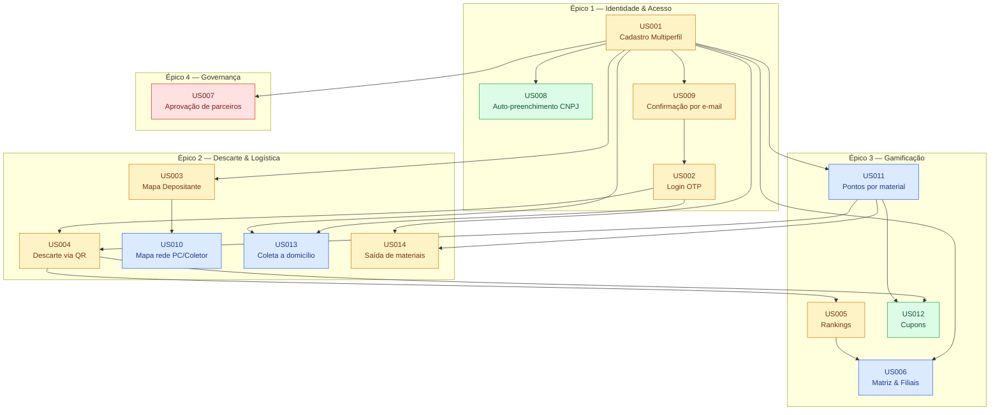
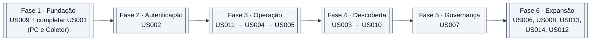
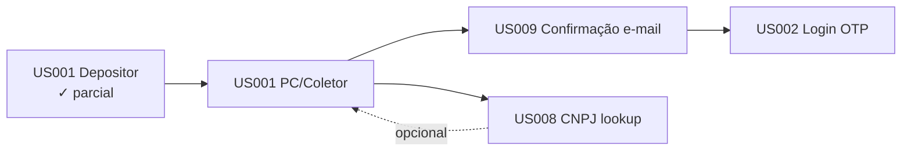
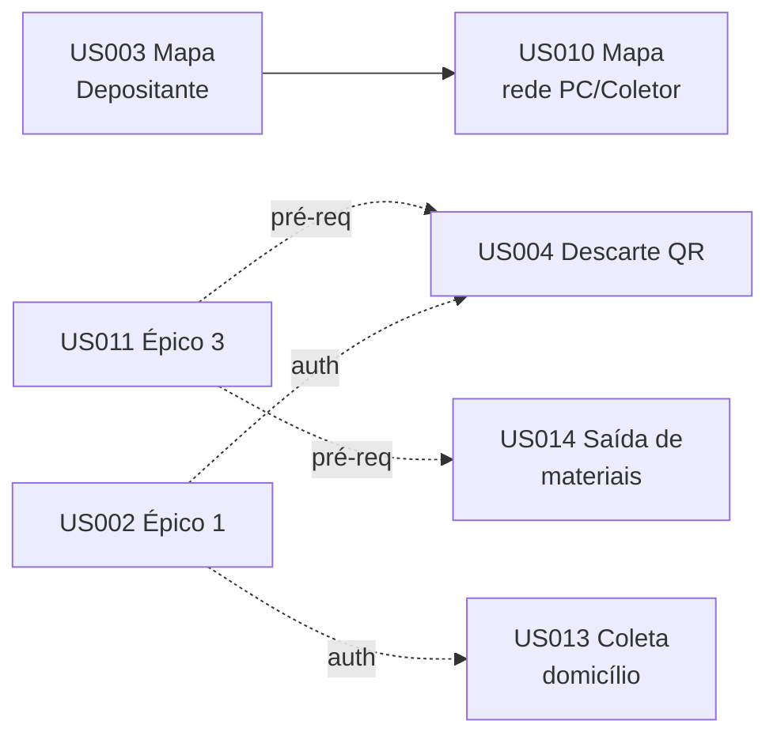
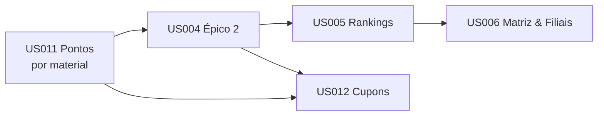
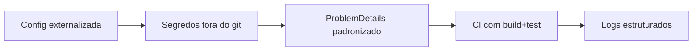

# EcoCell — Backlog Técnico

Derivado de [`PRD EcoCell – Ecossistema de Logística Reversa.md`](../PRD%20EcoCell%20%E2%80%93%20Ecossistema%20de%20Log%C3%ADstica%20Reversa.md). O PRD é a fonte de verdade do "porquê"; este arquivo é o "como" — tarefas pequenas, atômicas e rastreáveis.

## Convenções

- **Prioridade** herdada do RF: `Crítico` > `Essencial` > `Importante` > `Desejável`.
- **Status**: `[ ]` pendente · `[~]` em andamento · `[x]` concluído.
- **TDD obrigatório** (Red → Green → Refactor) — teste antes do código produtivo. Dentro de cada US as tarefas seguem a ordem: **Builders/DTOs → Testes (Red) → Implementação (Green) → Infra/API → Mobile → Testes de integração**.
- **Regras de Negócio (RN001–RN017, seção 5 do PRD) são normativas** — têm precedência sobre decisões de implementação. Citações `**RNxxx**` nas tarefas marcam aderência obrigatória.
- **DRY**: antes de criar, buscar reuso em `EcoCell.Communication`, `EcoCell.Exceptions`, `CommonTestUtilities`.
- **KISS**: nada de abstração sem dois consumidores reais.
- Summaries PT-BR em toda classe/método público.
- Rodar `dotnet test EcoCell.sln` ao final de cada tarefa.

---

## Visão macro — Dependências entre User Stories

## Plano MVP — Execução faseada

---

## Épico 1 — Gestão de Identidade e Acesso

### Fluxo interno do Épico 1

### US001 — Cadastro Multiperfil · RF001 · Essencial

**Dependências:** nenhuma.
**Estado atual:** `Person` unificada com flags (✓). `RegisterDepositorUseCase` parcial — validação e persistência prontas, envio de e-mail comentado em `RegisterDepositorUseCase.cs:69-75`. `RegisterOptions.razor` e `Depositors/RegisterDepositor.razor` existem. Faltam fluxos PC e Coletor.

**US001.A — Cadastro de Ponto de Coleta (Backend)**

- [ ] Criar `RequestRegisterCollectorPointJson` em `Communication/Requests/CollectorPoints/Register/`.
- [ ] Criar `RegisterCollectorPointValidator` reaproveitando regras PJ de `RegisterDepositorValidator`.
- [ ] **RN003**: Validator rejeita `PersonType = PF` (PC é exclusivo de PJ).
- [ ] Criar `RequestRegisterCollectorPointJsonBuilder` em `CommonTestUtilities/Requests/CollectorPoints/Register/`.
- [ ] `Validators.Test`: `RegisterCollectorPointValidatorTest.Success`.
- [ ] `Validators.Test`: casos de erro — documento vazio/inválido, e-mail inválido, endereço ausente, razão social obrigatória, **PersonType = PF rejeitado (RN003)**.
- [ ] `UseCases.Test`: `RegisterCollectorPointUseCaseTest.Success`.
- [ ] `UseCases.Test`: `Conflict_WhenDocumentExists`, `Conflict_WhenEmailExists`, `ValidationFailure`.
- [ ] `UseCases.Test`: **`Conflict_WhenPersonIsDepositor` (RN005 — Depositante não acumula)**.
- [ ] `UseCases.Test`: **`Conflict_WhenPersonIsCollector` (RN004 — PC não pode virar Coletor no inverso; caso oposto permitido)**.
- [ ] Criar `IRegisterCollectorPointUseCase` (apenas `Execute`).
- [ ] Implementar `RegisterCollectorPointUseCase` (setar `IsCollectorPoint = true`, status inicial `AwaitingConfirmation`).
- [ ] **RN003/RN005**: bloquear se já existir Person com mesmo documento com `IsDepositor = true`.
- [ ] Registrar DI em `DIExtensions.AddApplication`.
- [ ] Criar `CollectorPointEndpoints.cs` em `Api/Endpoints/CollectorPoints/` com `MapCollectorPointEndpoints`.
- [ ] Endpoint `POST /api/v1/collector-points`.
- [ ] Registrar extensão em `Program.cs`.
- [ ] `WebApi.Test/CollectorPoints/RegisterCollectorPointTest` — 201 Created e 400/409.

**US001.B — Cadastro de Coletor (Backend)**

- [ ] Criar `RequestRegisterCollectorJson`.
- [ ] Criar `RegisterCollectorValidator`.
- [ ] **RN003**: Validator rejeita `PersonType = PF` (Coletor é exclusivo de PJ).
- [ ] Criar `RequestRegisterCollectorJsonBuilder`.
- [ ] `Validators.Test`: `RegisterCollectorValidatorTest` (sucesso + erros equivalentes + **PersonType = PF rejeitado**).
- [ ] `UseCases.Test`: `RegisterCollectorUseCaseTest` (sucesso + conflitos).
- [ ] `UseCases.Test`: **`Conflict_WhenPersonIsDepositor` (RN005)**.
- [ ] `UseCases.Test`: **`Success_WhenPersonIsAlreadyCollectorPoint_SetsIsCollectorTrue` (RN004 — Coletor pode acumular PC)**.
- [ ] `IRegisterCollectorUseCase` + implementação (`IsCollector = true`; se já for PC, apenas acumula a flag — **RN004**).
- [ ] **RN005**: bloquear se Person existente tiver `IsDepositor = true`.
- [ ] Registrar DI.
- [ ] `CollectorEndpoints.cs` com `POST /api/v1/collectors`.
- [ ] Registrar extensão em `Program.cs`.
- [ ] `WebApi.Test/Collectors/RegisterCollectorTest`.

**US001.D — Validações cruzadas de perfil (transversal US001)**

> **Regras RN003, RN004 e RN005** — centraliza a lógica de acumulação de perfis para evitar duplicação nos três casos de uso.

- [ ] `UseCases.Test`: `ProfileCompatibilityRulesTest` cobrindo a matriz completa:
  - [ ] Depositante → tentar cadastrar PC/Coletor: **erro (RN005)**.
  - [ ] PC existente → cadastrar Coletor: **sucesso**, acumula flag (`IsCollector = true`) — **RN004**.
  - [ ] Coletor existente → cadastrar PC: **erro** (inverso não permitido) — **RN004**.
  - [ ] PF tentar cadastrar PC/Coletor: **erro (RN003)**.
- [ ] Se a mesma regra aparecer em 3 use cases (Depositor/PC/Coletor), extrair `IProfileCompatibilityChecker` em `Domain/Services` (condição KISS atendida: 3 consumidores reais).
- [ ] Adicionar mensagens específicas em `ResourceErrorMessages` (`PROFILE_EXCLUSIVE_TO_PJ`, `DEPOSITOR_CANNOT_ACCUMULATE_PROFILES`, `COLLECTOR_POINT_CANNOT_BECOME_COLLECTOR`).

**US001.C — Integração Mobile**

- [ ] Criar `ICollectorPointClient` (Refit) em `Services/Refit/`.
- [ ] Criar `ICollectorClient` (Refit).
- [ ] Registrar ambos via `AddRefitClient` em `MauiProgram.cs`.
- [ ] Criar `ICollectorPointViewModel` + `CollectorPointViewModel`.
- [ ] Criar `ICollectorViewModel` + `CollectorViewModel`.
- [ ] Página `Components/Pages/CollectorPoints/RegisterCollectorPoint.razor` (formulário MudBlazor).
- [ ] Página `Components/Pages/Collectors/RegisterCollector.razor`.
- [ ] Ajustar `RegisterOptions.razor` para roteamento por perfil selecionado.
- [ ] Reutilizar máscara de CNPJ de `wwwroot/js/masks.js`.

### US008 — Auto-preenchimento PJ via CNPJ · RF002 · Desejável

**Dependências:** US001 (fluxos PJ em tela).
**Estado atual:** inexistente.

**US008.A — Service de consulta**

- [ ] `UseCases.Test`: `CnpjLookupServiceTest` — sucesso, 404 (CNPJ inexistente), timeout, situação inativa.
- [ ] Domain: interface `Services/External/ICnpjLookupService` + DTO `CnpjLookupResult` (razão social, nome fantasia, CNAE, endereço, situação).
- [ ] Infrastructure: `BrasilApiCnpjLookupService` usando `IHttpClientFactory`.
- [ ] Adicionar `IMemoryCache` com TTL de 10 min para evitar throttling.
- [ ] Configurar `HttpClient` em `AddInfra` com `BaseAddress` `https://brasilapi.com.br/api/cnpj/v1/`.
- [ ] Tratamento: timeout de 5s, fallback transparente para preenchimento manual.

**US008.B — Exposição via API**

- [ ] `UseCases.Test`: `GetCnpjDataUseCaseTest`.
- [ ] Criar `GetCnpjDataUseCase` orquestrando lookup + mapeamento.
- [ ] Criar `ResponseCnpjLookupJson` em `Communication/Responses/`.
- [ ] Endpoint `GET /api/v1/cnpj/{document}`.
- [ ] `WebApi.Test`: teste de integração mockando `ICnpjLookupService`.

**US008.C — Mobile**

- [ ] Criar `ICnpjClient` (Refit).
- [ ] Handler de blur no campo CNPJ das páginas PJ para chamar o client.
- [ ] Exibir `MudProgressLinear` durante a chamada; `MudSnackbar` em caso de erro.
- [ ] Desabilitar auto-preenchimento se situação ≠ "Ativa" e exigir confirmação explícita.

### US009 — Confirmação de conta por e-mail · RF003 · Essencial

**Dependências:** US001.
**Estado atual:** `Person.VerificationCode` + `ExpirationDateVerificationCode` existem (✓). Builders `MailServiceBuilder` e `VerificationCodeJobsBuilder` existem. Envio está comentado em `RegisterDepositorUseCase.cs:69-75`.

**US009.A — Infra de e-mail**

- [ ] Adicionar pacote `MailKit` no `EcoCell.Infrastructure.csproj`.
- [ ] Criar `MailSettings` (Host, Port, User, Pass, From) em `Infrastructure/Settings/`.
- [ ] Implementar `MailKitMailService : IMailService` em `Infrastructure/Services/Notifications/`.
- [ ] Registrar em `AddInfra` com `IOptions<MailSettings>`.
- [ ] Documentar variáveis em `appsettings.Example.json`.
- [ ] Mover credenciais atuais para User Secrets.

**US009.B — Jobs de expiração/reenvio**

- [ ] `UseCases.Test`: `VerificationCodeJobsTest` — `Delete` limpa código; `Resend` gera novo + envia.
- [ ] Implementar `VerificationCodeJobs.Delete(personExternalId, minutes)` via Hangfire `BackgroundJob.Schedule`.
- [ ] Implementar `VerificationCodeJobs.Resend(personExternalId)`.
- [ ] Registrar DI.

**US009.C — Contador de tentativas**

- [ ] Domain: adicionar `Person.VerificationAttempts` (int, default 0).
- [ ] Migration EF Core `AddVerificationAttempts`.
- [ ] Atualizar `PersonConfiguration` se necessário.

**US009.D — Caso de uso de confirmação**

- [ ] `UseCases.Test`: `ConfirmAccountUseCaseTest.Success` (ativa conta, zera tentativas).
- [ ] `UseCases.Test`: `Error_WhenCodeExpired`, `Error_WhenCodeInvalid_IncrementsAttempts`, `Error_WhenMaxAttemptsReached_Blocks`, `Error_WhenAccountAlreadyActive`.
- [ ] Criar `RequestConfirmAccountJson` (document + code) + `ConfirmAccountValidator`.
- [ ] Criar `IConfirmAccountUseCase` + `ConfirmAccountUseCase`.
- [ ] Registrar DI.
- [ ] Endpoint `POST /api/v1/account/confirm`.
- [ ] Endpoint `POST /api/v1/account/resend-code`.
- [ ] `WebApi.Test/Account/ConfirmAccountTest`.

**US009.E — Religar envio no cadastro**

- [ ] Remover TODO e descomentar bloco em `RegisterDepositorUseCase.Execute` (`Task.Run` → `WhenAll`).
- [ ] Replicar o mesmo bloco em `RegisterCollectorPointUseCase` e `RegisterCollectorUseCase`.
- [ ] Considerar extrair para serviço compartilhado `IAccountVerificationOrchestrator` se duplicação ocorrer 3×.

**US009.F — Mobile**

- [ ] Página `Components/Pages/Account/ConfirmAccount.razor` com 6 inputs.
- [ ] Botão "Reenviar código" com cooldown de 60s.
- [ ] Redirecionamento automático para tela de login ao confirmar.
- [ ] `IAccountClient` já existe — adicionar métodos `Confirm` e `Resend`.

### US002 — Login Passwordless (OTP) · RF004 · Essencial

**Dependências:** US009 (reutiliza `IMailService` e lógica de código).
**Estado atual:** inexistente.

**US002.A — Emissão de JWT**

- [ ] Domain: `Services/Security/ITokenService` (`Generate(person) → string`).
- [ ] Infrastructure: `JwtTokenService` com claims `sub` (ExternalId), `role`, `person_type`.
- [ ] Configuração `JwtSettings` (Issuer, Audience, SigningKey, ExpirationMinutes).
- [ ] Registrar DI em `AddInfra`.
- [ ] Configurar `AddAuthentication().AddJwtBearer()` em `Program.cs`.

**US002.B — Solicitar código**

- [ ] `UseCases.Test`: `RequestLoginCodeUseCaseTest` — conta ativa (gera + envia), inexistente (silencioso para evitar enumeração), pendente de confirmação, bloqueada.
- [ ] `UseCases.Test`: **`Success_WhenIdentifierIsEmail` e `Success_WhenIdentifierIsDocument` (RN010 — login aceita CPF/CNPJ OU e-mail)**.
- [ ] Criar `RequestLoginCodeJson` com campo `Identifier` (documento ou e-mail) + validator que detecta e valida ambos os formatos.
- [ ] Criar `IRequestLoginCodeUseCase` + implementação (resolve Person por documento OU e-mail; reutiliza `IVerificationCodeService`).
- [ ] Endpoint `POST /api/v1/auth/request-code`.
- [ ] Rate limit (ex.: 5 req/min por IP) via `AddRateLimiter`.

**US002.C — Verificar código e logar**

- [ ] `UseCases.Test`: `VerifyLoginCodeUseCaseTest` — sucesso (retorna token), código inválido, expirado, bloqueio após 3 tentativas.
- [ ] Criar `RequestVerifyLoginJson` + `ResponseLoginJson` (token + expiresAt + person).
- [ ] Criar `IVerifyLoginCodeUseCase` + implementação.
- [ ] Endpoint `POST /api/v1/auth/verify`.
- [ ] `WebApi.Test/Auth/LoginFlowTest`.

**US002.D — Mobile**

- [ ] Página `Components/Pages/Auth/Login.razor` com **input único que aceita documento OU e-mail (RN010)**, com toggle visual ou detecção automática de formato → redireciona para confirmação.
- [ ] Página `Components/Pages/Auth/VerifyLogin.razor` (6 inputs, reaproveitar componente de US009).
- [ ] Criar `IAuthClient` (Refit).
- [ ] Criar `AuthTokenHandler : DelegatingHandler` anexando `Authorization: Bearer` nos demais clients.
- [ ] Armazenar token via `SecureStorage.Default` do MAUI.
- [ ] Criar `IAuthStateService` para controlar login/logout e expiração.
- [ ] Ajustar `App.xaml.cs` para redirecionar conforme estado.

---

## Épico 2 — Operação de Descarte e Logística

### Fluxo interno do Épico 2

### US003 — Mapa do Depositante · RF005 · Essencial

**Dependências:** US001 (PCs/Coletores ativos).
**Estado atual:** `Address` existe, sem lat/lng. Sem endpoint espacial e sem UI de mapa.

**US003.A — Geolocalização no endereço**

> **RN009**: Pontos de Coleta e Coletores **devem obrigatoriamente** validar endereço geocodificado para exibição no mapa — não é opcional.

- [ ] Domain: adicionar `Address.Latitude`, `Address.Longitude` (`decimal`, **obrigatórios para PC/Coletor**; opcionais para Depositante).
- [ ] Migration `AddGeolocationToAddress`.
- [ ] Atualizar `AddressConfiguration` (precision 9,6).
- [ ] Criar `IGeocodingService` em `Domain/Services/External` + implementação `NominatimGeocodingService` (ou Google Geocoding — documentar escolha).
- [ ] `UseCases.Test`: `GeocodingServiceTest` — sucesso, endereço inválido, timeout (fallback: bloquear cadastro de PC/Coletor).
- [ ] Registrar DI + `HttpClient` configurado em `AddInfra`.
- [ ] Integrar no `RegisterCollectorPointUseCase` e `RegisterCollectorUseCase` — **bloquear cadastro se geocoding falhar** (RN009).
- [ ] Para Depositante: geocoding é best-effort (não bloqueia).

**US003.B — Busca espacial**

- [ ] `UseCases.Test`: `SearchNearbyPointsUseCaseTest` — filtro por raio, por cidade, por tipo de perfil, sem resultados.
- [ ] Criar `RequestNearbySearchJson` (lat, lng, radius, types[]).
- [ ] Criar `ResponseNearbyPointJson`.
- [ ] Criar `ISearchNearbyPointsUseCase` + implementação (Haversine em SQL via `FromSqlInterpolated` — **KISS**; PostGIS só se performance exigir).
- [ ] Adicionar `IPersonRepository.SearchNearby(lat, lng, radiusKm, types)`.
- [ ] Endpoint `GET /api/v1/map/nearby`.
- [ ] `WebApi.Test/Map/SearchNearbyTest`.

**US003.C — UI de mapa**

- [ ] Decisão técnica: avaliar Google Maps SDK vs Leaflet (documentar escolha no repo).
- [ ] Instalar biblioteca escolhida no Mobile.
- [ ] Criar `IMapClient` (Refit) + `MapViewModel`.
- [ ] Criar `Services/Geolocation/ILocationService` usando `Geolocation.Default`.
- [ ] Página `Components/Pages/Map/Nearby.razor` — pins diferenciados por `IsCollectorPoint`/`IsCollector`.
- [ ] Busca por cidade (fallback quando GPS negado).
- [ ] Pop-up com ficha do ator (nome, endereço, contato).

### US004 — Descarte via QR Code · RF007 · Essencial

**Dependências:** US001, US002, US011.
**Estado atual:** `DiscardHistory`, `DepositorScoreTransaction`, `DepositorTotalScore` existem (✓).

**US004.A — Geração do QR do PC**

- [ ] `UseCases.Test`: `GeneratePcQrCodeUseCaseTest` — código único, expira a cada rotação (ex.: a cada 1h — **KISS**: sem expiração inicial).
- [ ] Criar `GeneratePcQrCodeUseCase` que retorna string determinística (ex.: `ecocell://pc/{externalId}`).
- [ ] Endpoint `GET /api/v1/collector-points/me/qr`.
- [ ] Tela `Components/Pages/CollectorPoints/MyQrCode.razor` gerando QR com `QRCoder`.

**US004.B — Abertura de descarte (Depositante)**

- [ ] `UseCases.Test`: `RegisterDiscardUseCaseTest` — sucesso, QR inválido, PC inativo, material não aceito pelo PC.
- [ ] Revisar entidade `DiscardHistory` — garantir `Status` (Pending/Confirmed/Rejected) e `ItemList` (material + quantidade/peso).
- [ ] Migration se houver mudança.
- [ ] Criar `RequestRegisterDiscardJson` (pcExternalId, items[]) + validator.
- [ ] Criar `IRegisterDiscardUseCase` + implementação (cria `DiscardHistory` em `Pending`).
- [ ] Endpoint `POST /api/v1/discards`.

**US004.C — Confirmação pelo PC**

- [ ] `UseCases.Test`: `ConfirmDiscardUseCaseTest` — sucesso (credita pontos via job), rejeição, não pertence ao PC, já confirmado.
- [ ] Criar `RequestConfirmDiscardJson` (items confirmados: material, peso/qty) + validator.
- [ ] Criar `IConfirmDiscardUseCase` + implementação (transição de estado + enfileira `CreditScoreJob`).
- [ ] Endpoint `POST /api/v1/discards/{id}/confirm`.
- [ ] Endpoint `POST /api/v1/discards/{id}/reject`.
- [ ] `WebApi.Test/Discards/DiscardFlowTest`.

**US004.D — Crédito de pontuação (async)**

- [ ] `UseCases.Test`: `CreditScoreJobTest` — aplica regra vigente (US011), grava `DepositorScoreTransaction`, atualiza `DepositorTotalScore`.
- [ ] `UseCases.Test`: **`NoPointsCreditedWhenDepositorIsAdminOrSupport` (RN013)** — descarte é registrado, mas não gera transação de pontos nem atualiza total.
- [ ] Criar `CreditScoreJob` (Hangfire) disparado por US004.C.
- [ ] **RN013**: job ignora crédito quando `Person.Role ∈ { Admin, Support }` — registrar auditoria no `DiscardHistory` para rastreabilidade.
- [ ] Lookup da regra via `IMaterialScoreRuleRepository.GetCurrent(pcId, material, at)`.

**US004.E — Mobile**

- [ ] Instalar `ZXing.Net.Maui` (ZXing.Net.Mobile está descontinuado).
- [ ] Criar `IDiscardClient` (Refit).
- [ ] Página `Components/Pages/Discards/Scan.razor` (Depositante) — leitor + preview do PC.
- [ ] Página `Components/Pages/Discards/Confirm.razor` (PC) — lista de descartes pendentes + form de peso.
- [ ] Notificação local quando o PC receber novo descarte pendente (MAUI `LocalNotifications`).

### US010 — Mapa da rede (PC/Coletor) · RF006 · Importante

**Dependências:** US003 (reusa endpoint + componente).
**Estado atual:** depende de US003.

- [ ] Estender `SearchNearbyPointsUseCase` com filtro combinado (ex.: `types=CollectorPoint,Collector`).
- [ ] `UseCases.Test` complementar com novo cenário.
- [ ] Criar rota `Components/Pages/Map/Network.razor` reutilizando componente de US003.
- [ ] Policy de autorização: visível apenas para `IsCollectorPoint` ou `IsCollector` autenticados.
- [ ] Filtro alternável "Ver apenas PCs" / "Ver apenas Coletores".

### US013 — Coleta a domicílio · RF010 · Importante

**Dependências:** US001, US002.
**Estado atual:** inexistente.

**US013.A — Domínio**

- [ ] Criar enum `HomePickupStatus { Requested, Accepted, Rejected, Completed, Canceled }`.
- [ ] Criar `HomePickupRequest` (Depositor, Collector, Address, ScheduledAt, Status, Items).
- [ ] Criar `HomePickupCoverage` (Collector, Neighborhood ou Polygon — **KISS**: lista de bairros).
- [ ] Adicionar `Person.HomePickupEnabled`.
- [ ] Migration.
- [ ] `IHomePickupRequestRepository` + `IHomePickupCoverageRepository`.

**US013.B — Habilitação pelo Coletor**

- [ ] `UseCases.Test`: `EnableHomePickupUseCaseTest`.
- [ ] Caso de uso + endpoint `PUT /api/v1/collectors/me/home-pickup`.
- [ ] Tela de configuração no Mobile.

**US013.C — Solicitação pelo Depositante**

- [ ] `UseCases.Test`: `RequestHomePickupUseCaseTest` — sucesso, Coletor fora de área, Coletor desabilitado.
- [ ] Caso de uso + validator + endpoint `POST /api/v1/home-pickups`.
- [ ] Tela `Components/Pages/Pickups/RequestPickup.razor`.

**US013.D — Fluxo Aceite/Recusa/Confirmação**

- [ ] `UseCases.Test`: `AcceptHomePickupUseCaseTest`, `RejectHomePickupUseCaseTest`, `ConfirmHomePickupUseCaseTest` (double-check).
- [ ] 3 casos de uso + endpoints `POST /api/v1/home-pickups/{id}/{accept|reject|confirm}`.
- [ ] `WebApi.Test/HomePickups/HomePickupFlowTest`.
- [ ] Tela fila de atendimento (Coletor) + histórico (Depositante).

### US014 — Saída de materiais para Coletor · RF014 · Essencial

**Dependências:** US001, US011.
**Estado atual:** inexistente.

**US014.A — Domínio**

- [ ] Criar enum `MaterialDispatchStatus { Pending, Confirmed, Rejected }`.
- [ ] Criar `MaterialDispatch` (OriginPc, DestinationCollector, DispatchedAt, ConfirmedAt?, Status).
- [ ] Criar `MaterialDispatchItem` (Dispatch, Material, Weight, Quantity).
- [ ] Migration + repositório.

**US014.B — Registro pelo PC**

- [ ] `UseCases.Test`: `RegisterMaterialDispatchUseCaseTest` — sucesso, Coletor inativo, peso ≤ 0, material não aceito.
- [ ] `RequestRegisterDispatchJson` + validator.
- [ ] Caso de uso + endpoint `POST /api/v1/dispatches`.
- [ ] Tela `Components/Pages/Dispatches/Register.razor`.

**US014.C — Confirmação pelo Coletor**

- [ ] `UseCases.Test`: `ConfirmMaterialDispatchUseCaseTest`.
- [ ] Caso de uso + endpoint `POST /api/v1/dispatches/{id}/confirm` / `reject`.
- [ ] Tela de recebimentos pendentes (Coletor).
- [ ] `WebApi.Test/Dispatches/DispatchFlowTest`.

**US014.D — Histórico**

- [ ] `UseCases.Test`: `ListDispatchesUseCaseTest` (filtros por período, material, contraparte).
- [ ] Endpoint `GET /api/v1/dispatches` com paginação.
- [ ] Tela "Movimentações" unificada para PC e Coletor.

### US015 — Descarte direto para Coletor · RN012 · Importante

> **RN012**: Depositantes e Pontos de Coleta podem realizar descarte direto (entrega no local ou coleta agendada) com um usuário do tipo Coletor. US013 cobre o caso Depositante ↔ Coletor **com coleta domiciliar**; US014 cobre PC → Coletor (saída de estoque). Esta US cobre o fluxo faltante: **entrega presencial direta** (Depositante leva até o Coletor ou PC leva até o Coletor sem agendamento).

**Dependências:** US001, US002, US011.
**Estado atual:** inexistente.

- [ ] Avaliar se US015 é US independente ou extensão de US004/US014 — decisão arquitetural: reaproveitar `DiscardHistory`/`MaterialDispatch` vs. entidade nova `DirectDropOff`. Documentar no PRD antes de implementar.
- [ ] `UseCases.Test`: `RegisterDirectDropOffUseCaseTest` — Depositante → Coletor (gera pontos); PC → Coletor sem agendamento.
- [ ] `UseCases.Test`: `ConfirmDirectDropOffUseCaseTest` (double-check pelo Coletor).
- [ ] DTOs, validator, endpoint `POST /api/v1/direct-dropoffs`.
- [ ] Tela Mobile (Depositante e PC) — seleção de Coletor destino + lista de itens.
- [ ] Tela de confirmação (Coletor).
- [ ] Integração com `CreditScoreJob` para creditar pontos quando o ator de origem for Depositante.

---

## Épico 3 — Gamificação e Engajamento

### Fluxo interno do Épico 3

### US011 — Tabela de pontuação por material · RF008 · Importante

**Dependências:** US001.
**Estado atual:** enum `EletronicMaterials` existe (✓).

**US011.A — Domínio + persistência**

- [ ] Criar `MaterialScoreRule` (PersonId, Material, Points, Unit [PerUnit/PerKg], ValidFrom, ValidTo?).
- [ ] `IMaterialScoreRuleRepository` com `GetCurrent(pcId, material, at)`.
- [ ] `MaterialScoreRuleConfiguration` + migration.

**US011.B — Definição pelo PC**

- [ ] `UseCases.Test`: `SetMaterialScoreRulesUseCaseTest` — criação versiona (fecha `ValidTo` da anterior), nunca altera histórico.
- [ ] `RequestSetMaterialScoreRulesJson` + validator.
- [ ] Caso de uso + endpoint `PUT /api/v1/collector-points/me/score-rules`.

**US011.C — Consulta pública**

- [ ] `UseCases.Test`: `GetCurrentMaterialScoreRulesUseCaseTest`.
- [ ] Endpoint `GET /api/v1/collector-points/{externalId}/score-rules`.
- [ ] Exibir na ficha do PC no mapa (US003).

**US011.D — Mobile (PC)**

- [ ] Tela `Components/Pages/CollectorPoints/ScoreRules.razor`.
- [ ] Client Refit + ViewModel.

### US005 — Rankings · RF011 · Essencial

**Dependências:** US004 (gera pontos).
**Estado atual:** `DepositorTotalScore` e `DepositorScoreTransaction` existem (✓).

**US005.A — Agregação**

- [ ] Criar view `v_ranking_depositor` (agrupar por PersonType + City).
- [ ] Criar view `v_ranking_collector_point_national` (somando Matriz + Filiais).
- [ ] Criar view `v_ranking_collector_point_municipal`.
- [ ] Criar view `v_ranking_collector`.
- [ ] Migration via `MigrationBuilder.Sql`.
- [ ] Índices em `DepositorTotalScore.PersonId` e `Address.City`.

**US005.B — Caso de uso**

- [ ] `UseCases.Test`: `GetRankingUseCaseTest` — cada combinação `scope × category`, paginação, filtro por cidade.
- [ ] Enum `RankingScope { Municipal, National }`.
- [ ] Enum `RankingCategory { DepositorPf, DepositorPj, CollectorPointHeadquarters, CollectorPointBranch, Collector }`.
- [ ] `RequestGetRankingJson` (scope, category, city?, page, pageSize).
- [ ] `ResponseRankingItemJson` (position, name, score, city).
- [ ] Caso de uso + endpoint `GET /api/v1/rankings`.

**US005.C — Mobile**

- [ ] Página `Components/Pages/Rankings/Leaderboard.razor` com `MudTabs` (uma aba por categoria).
- [ ] Filtro de cidade e switch Municipal/Nacional.

### US006 — Matriz e Filiais · RF012 · Importante

**Dependências:** US001. Se liga com US005 (agregação nacional).
**Estado atual:** enum `PersonSubtype { Headquarters, Branch }` existe (✓).

**US006.A — Relacionamento**

- [ ] Domain: adicionar `Person.HeadquartersId?` e navegação `Branches`.
- [ ] Migration `AddPersonHeadquartersRelationship` com índice.
- [ ] `PersonConfiguration` atualizado com `HasMany(Branches).WithOne(Headquarters)`.

**US006.B — Casos de uso**

- [ ] `UseCases.Test`: `LinkBranchUseCaseTest` — só Matriz vincula, filial não pode ter filha, impede ciclo, impede vincular PJ de CNPJ diferente.
- [ ] `UseCases.Test`: `UnlinkBranchUseCaseTest`.
- [ ] Casos de uso + endpoints `POST /api/v1/collector-points/{id}/branches` e `DELETE .../branches/{branchId}`.
- [ ] Ajustar `GetRankingUseCase` (US005) para somar pontos Matriz+Filiais na categoria `CollectorPointHeadquarters` no escopo Nacional.

**US006.C — Mobile**

- [ ] Tela "Minha rede" (Matriz) listando filiais e contribuição individual.
- [ ] Fluxo de convite/vínculo por CNPJ.

### US012 — Cupons de benefícios · RF009 · Desejável

**Dependências:** US004, US011.
**Estado atual:** inexistente.

**US012.A — Regras de cupom**

- [ ] Criar `CouponRule` (PcId, ThresholdPoints, Benefit, ValidDays, Active).
- [ ] Migration + repositório.
- [ ] `UseCases.Test`: `CreateCouponRuleUseCaseTest`, `DeactivateCouponRuleUseCaseTest`.
- [ ] Casos de uso + endpoints CRUD sob `/api/v1/collector-points/me/coupon-rules`.
- [ ] Tela "Regras de cupons" (PC).

**US012.B — Emissão automática**

- [ ] Criar `IssuedCoupon` (Code, PersonId, RuleId, Status, IssuedAt, ExpiresAt, RedeemedAt?).
- [ ] `UseCases.Test`: `IssueCouponOnScoreJobTest` — dispara ao confirmar descarte, gera código único, não duplica.
- [ ] `IssueCouponOnScoreJob` (Hangfire) enfileirado após US004.D.

**US012.C — Resgate**

- [ ] `UseCases.Test`: `RedeemCouponUseCaseTest` — sucesso, expirado, já resgatado, PC diferente do emissor.
- [ ] Caso de uso + endpoint `POST /api/v1/coupons/{code}/redeem`.
- [ ] Tela "Meus cupons" (Depositante) com QR do código.
- [ ] Tela "Resgatar cupom" (PC) via leitura de QR.

### US016 — Selos ESG de Meio Ambiente · RN017 · Desejável

> **RN017**: O sistema atribui "Selos de Meio Ambiente" para Pessoas Jurídicas que atingirem metas de volume de descarte (Depositante PJ) ou coleta (PC/Coletor).

**Dependências:** US004 (registra descartes), US014 (registra coletas).
**Estado atual:** inexistente.

**US016.A — Domínio**

- [ ] Criar enum `EsgBadgeType` (ex.: `Bronze`, `Silver`, `Gold`, `Platinum`) com limiares em kg.
- [ ] Criar entidade `EsgBadge` (PersonId, Type, AwardedAt, PeriodStart, PeriodEnd, VolumeKg).
- [ ] Criar `IEsgBadgeRepository`.
- [ ] Migration `AddEsgBadges`.

**US016.B — Cálculo e atribuição**

- [ ] `UseCases.Test`: `EvaluateEsgBadgesJobTest` — calcula volume agregado por PJ no período, concede selos conforme limiares, não duplica selo já atribuído.
- [ ] Criar `EvaluateEsgBadgesJob` (Hangfire recorrente — mensal ou trimestral).
- [ ] Lógica: soma peso de `DiscardHistory` (por Depositante PJ) e `MaterialDispatch`+`HomePickupRequest` (por Coletor/PC).
- [ ] Enfileirar notificação (`INotificationService`) ao conceder selo.

**US016.C — Exibição**

- [ ] Endpoint `GET /api/v1/persons/{externalId}/badges`.
- [ ] Exibir selos na ficha do PC/Coletor no mapa (US003/US010) e no perfil do Depositante PJ.
- [ ] `WebApi.Test/EsgBadges/ListBadgesTest`.

---

## Épico 4 — Administração e Governança

### US007 — Aprovação de parceiros · RF013 · Crítico

**Dependências:** US001.
**Estado atual:** `PersonStatus.AwaitingConfirmation` existe (✓). Falta expansão da máquina de estados.

**US007.A — Máquina de estados**

- [ ] Revisar `PersonStatus`: `AwaitingConfirmation → AwaitingApproval → Active | Rejected`; `Active → Blocked`.
- [ ] Atualizar `ConfirmAccountUseCase` (US009): PF ativa direto; PJ vai para `AwaitingApproval`.
- [ ] Migration se houver novos valores.
- [ ] Testes de transição.

**US007.B — Casos de uso administrativos**

- [ ] `UseCases.Test`: `ListPendingPartnersUseCaseTest`.
- [ ] `UseCases.Test`: `ApprovePartnerUseCaseTest`, `RejectPartnerUseCaseTest` (com motivo), `BlockPartnerUseCaseTest`.
- [ ] `UseCases.Test`: **`RejectPartnerUseCaseTest.SendsRejectionEmail` (RN008)** — disparo automático de e-mail com o motivo ao reprovar.
- [ ] Casos de uso + DTOs + validators.
- [ ] **RN008**: `RejectPartnerUseCase` enfileira Hangfire job `SendRejectionEmailJob` usando `IMailService` (reuso de US009).
- [ ] Template de e-mail de reprovação com motivo + orientação de correção.
- [ ] Policy `Admin` baseada em `Role` (US002 precisa emitir essa claim).
- [ ] Endpoints `GET /api/v1/admin/partners?status=pending`, `POST .../{id}/approve|reject|block`.
- [ ] `WebApi.Test/Admin/PartnerApprovalTest`.

**US007.C — Interface**

- [ ] **Decisão pendente** (discutir com PO): dashboard web Blazor separado (recomendado) vs. área administrativa no próprio MAUI. Anotar decisão no PRD.
- [ ] Após decisão: telas de listagem + aprovação/rejeição com campo de motivo.

---

## Transversal — Infra, qualidade e DX

Itens que destravam múltiplas US:

- [ ] Externalizar `BaseAddress` do Mobile de `MauiProgram.cs` para `wwwroot/config.json` (arquivo já existe em stage).
- [ ] Remover `appsettings.Development.json` do versionamento; criar `appsettings.Example.json`.
- [ ] Middleware de exceção: padronizar retorno `ProblemDetails`.
- [ ] Configurar Hangfire com PostgreSQL em `Production` e in-memory em `Development` — verificar `AddInfra`.
- [ ] Pipeline CI com `dotnet build` + `dotnet test EcoCell.sln`.
- [ ] Limpar pastas `obj/Debug/net9.0` órfãs (migração para net10 incompleta).
- [ ] Definir estratégia para iOS no Mobile (hoje só `net10.0-android`).
- [ ] Adotar `AutoMapper` OU mappers manuais — decidir e aplicar consistentemente.
- [ ] Logs estruturados com Serilog + sink console/arquivo.

### Fluxo transversal sugerido

